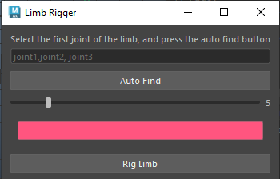
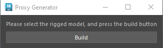

# My Maya Plugins

## Limb Rigger

[Limb Rigger]("./src/LimbRigger.py")

This plugin rigs any 3 joint limb with ik and fk and ikfk blend.

* support auto joint finding
* controller size control
* controller color control

# Proxy Generator

## How the code works

* It imports necessary modules
* Defines two classes called ProxyGenerator and ProxyGeneratorWidget
* Defines functions such as BuildProxyForSelectedMesh, CreateProxyModelForJntAndVerts,GenerateJntVertDict, GetJntWithMaxInfluence, and GetWidgetUniqueName
* In ProxyGenerator the functions are used to check for a mesh, get the skin and joints, and then make a proxy model with seperated pieces.
* In ProxyGeneratorWidget it creates UI with text to inform the user what to do, a "Build" button for the user to press, connects the button with what to do when it is clicked, and gives the window a name. The ProxyGeneratorWidget also has a function that returns a unique name.

## What the tool does for now

The tool seperates/breaks down the mesh into pieces.

## The classes, the functions, the logic behind the tool

* The classes are ProxyGenerator and ProxyGeneratorWidget
* The functions are BuildProxyForSelectedMesh, CreateProxyModelForJntAndVerts,GenerateJntVertDict, GetJntWithMaxInfluence, and GetWidgetUniqueName
* The logic behind the tool revolves around making a proxy model for the selected mesh objects, the proxy representations will then be used as an easier way to manipulate the 3D model such as hiding the different body parts in order to focus on a specific part that is needed to be worked on for animation.